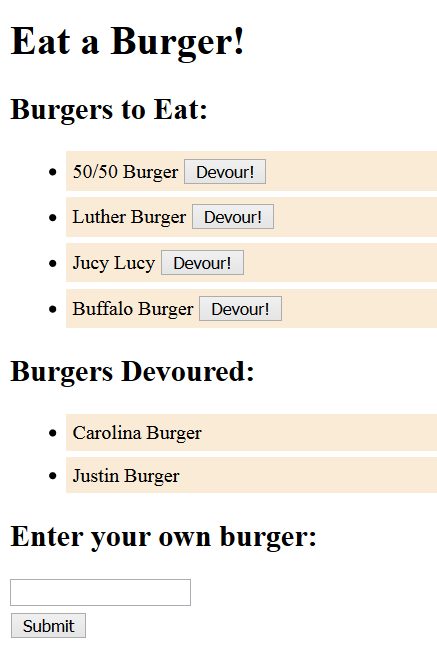
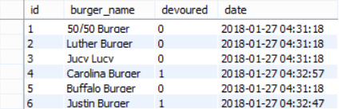

# Eat a Burger

## Overview

Full stack web application deployed on Heroku, utilizing Node, Express, MySQL, and a custom ORM.

Users can 'Devour' a burger that is already on the menu under 'Burgers to Eat' or add their own burger for consumption.

As burgers are devoured, they are moved from 'Burgers to Eat' to 'Burgers Devoured' on the front end, and follow the same pattern on the back end database.

## Heroku

Try it out now @ http://eat-a-burger-app.herokuapp.com/

## Future Development

* Update front end display so it is more engaging.
* Update concept of the app.

## Authors

* **Justin Flick** - *Everything*